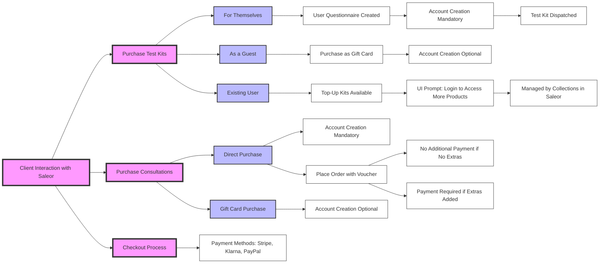

# Complete Flow of Applications: Saleor Use Case

## Overview

Saleor is utilized for client interactions where users can purchase primarily test kits and consultations. This document provides a detailed explanation of the Saleor flow, capturing every minute detail of the process. It clarifies the different purchasing scenarios for clients, including the handling of test kits, gift cards, and consultations. Additionally, it outlines the conditions for account creation and checkout procedures.

## Client Purchase Flow in Saleor

### Purchasing Test Kits

1. **Types of Test Kits:**
   - **Regular Test Kits:** Available to all users.
   - **Top-Up Kits:** Available exclusively to existing, logged-in users.

2. **Buying for Themselves:**
   - **User Questionnaire:** When a client purchases a test kit for themselves, a user questionnaire is generated.
   - **Dispatch:** The test kit is dispatched to the user after completing the questionnaire.
   - **Mandatory Account Creation:** Users must create an account to purchase a test kit for themselves.

3. **Buying as a Guest:**
   - **Gift Card Purchase:** Guests can only purchase test kits as gift cards. No user questionnaire is generated.
   - **Voluntary Account Creation:** Account creation is optional for guests purchasing gift cards.

4. **Existing Users:**
   - **Top-Up Kits Visibility:** Logged-in users see a special collection of top-up kits.
   - **UI Notification:** A message in the UI prompts users to log in to access products not available to new users. This is managed by collections in Saleor.

### Purchasing Consultations

1. **Types of Purchases:**
   - **Direct Purchase:** Users can buy consultations directly for themselves.
   - **Gift Card Purchase:** Users can also purchase consultations as gift cards.

2. **Account Creation Logic:**
   - **Voluntary Sign-Up:** If users are only purchasing gift cards, signing up is voluntary.
   - **Mandatory Sign-Up:** If users purchase consultations for themselves, creating an account is mandatory.

3. **Voucher Users:**
   - **Placing Orders:** Users with vouchers can place orders and redeem them without any additional payment, provided no extra products are included.
   - **Payment Details:** The checkout process will not request payment details from voucher users unless additional products are ordered.

### Checkout Process

1. **Payment Methods:**
   - Saleor integrates with Stripe, Klarna, PayPal for processing our payments.

2. **Payment Details Requirement:**
   - **Without Additional Products:** Voucher users are not required to provide payment details if no extra products are ordered.
   - **With Additional Products:** If additional products are included in the order, users must provide payment details.

## Integration and Webhooks

- Saleor actions are communicated to other applications via webhooks, centralized by Gotofy.
- This document focuses exclusively on the Saleor flow, and other integrations are managed separately.

